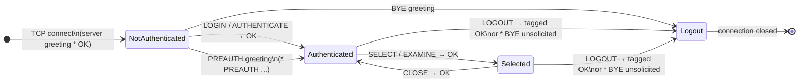
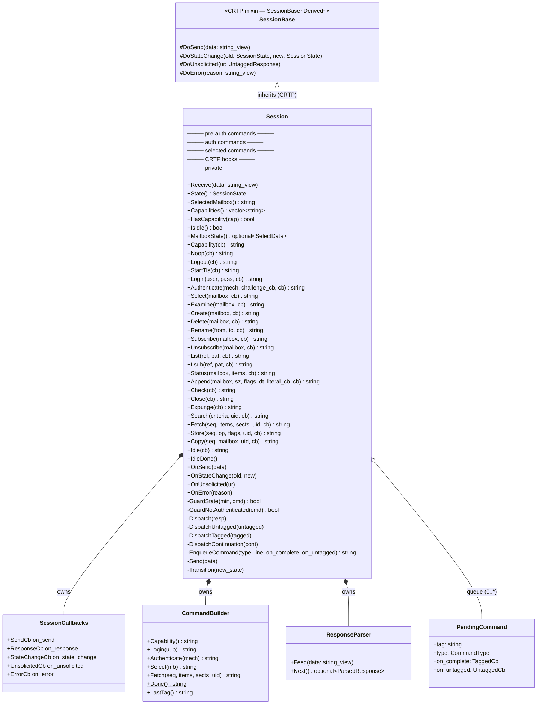
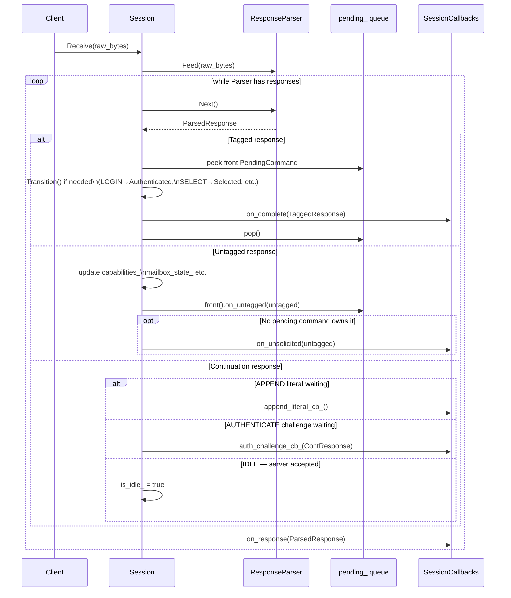
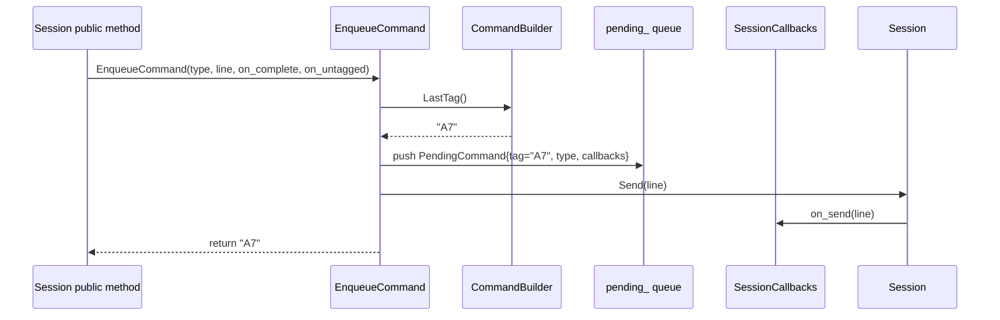

# Session State Machine & Architecture

## 1. RFC 3501 §3 State Machine

### Commands allowed per state

| Command | NotAuthenticated | Authenticated | Selected |
|---------|:---:|:---:|:---:|
| `CAPABILITY` | ✓ | ✓ | ✓ |
| `NOOP` | ✓ | ✓ | ✓ |
| `LOGOUT` | ✓ | ✓ | ✓ |
| `STARTTLS` | ✓ | — | — |
| `LOGIN` | ✓ | — | — |
| `AUTHENTICATE` | ✓ | — | — |
| `SELECT` / `EXAMINE` | — | ✓ | ✓ |
| `CREATE` / `DELETE` / `RENAME` | — | ✓ | ✓ |
| `SUBSCRIBE` / `UNSUBSCRIBE` | — | ✓ | ✓ |
| `LIST` / `LSUB` / `STATUS` | — | ✓ | ✓ |
| `APPEND` | — | ✓ | ✓ |
| `CHECK` / `CLOSE` | — | — | ✓ |
| `EXPUNGE` / `SEARCH` | — | — | ✓ |
| `FETCH` / `STORE` / `COPY` | — | — | ✓ |
| `IDLE` | — | — | ✓ |

> Commands sent in the wrong state are silently rejected by `GuardState` /
> `GuardNotAuthenticated` — `on_error` is invoked and nothing is sent to
> the server.

---

## 2. CRTP Class Architecture

---

## 3. Internal Receive / Dispatch Loop

---

## 4. EnqueueCommand — Command Pipeline

