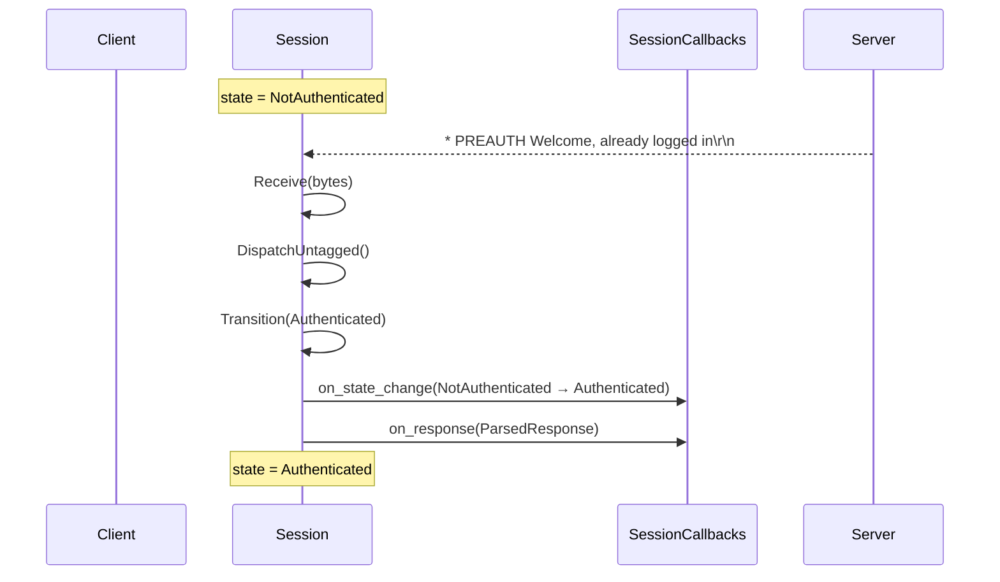
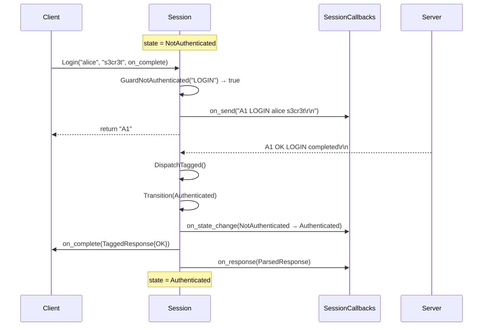
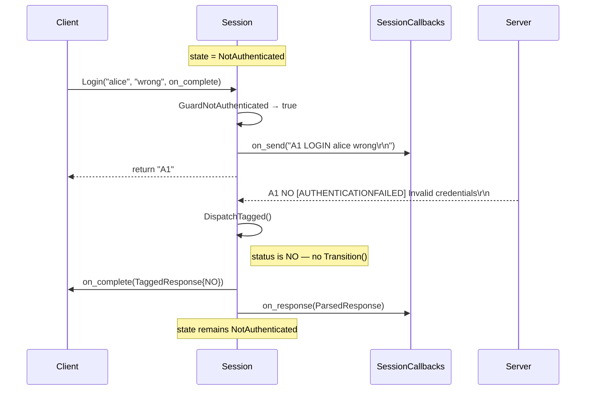
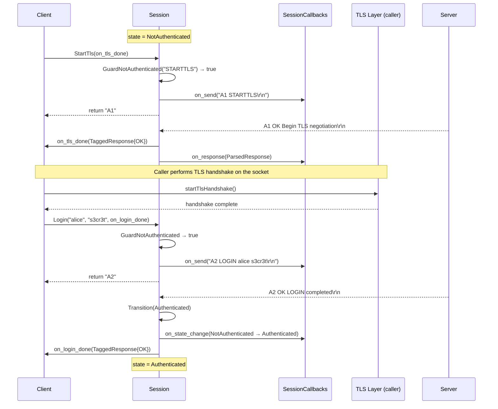
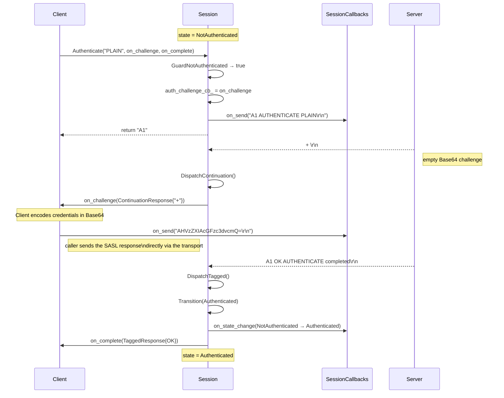
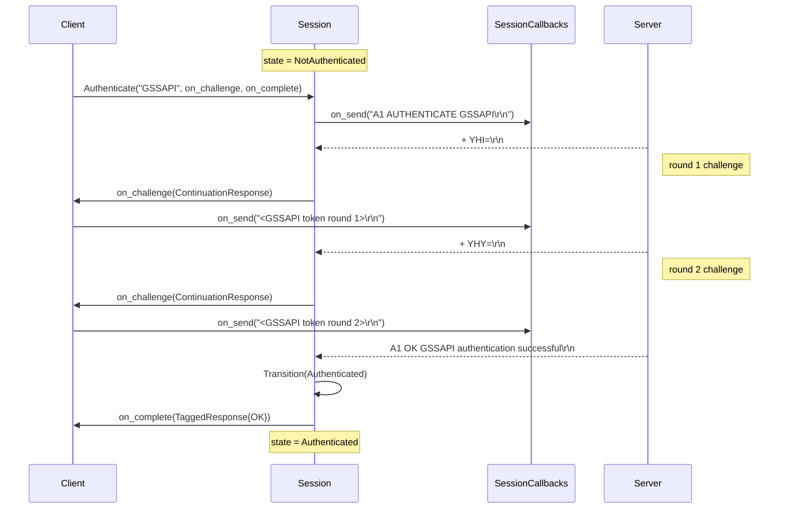
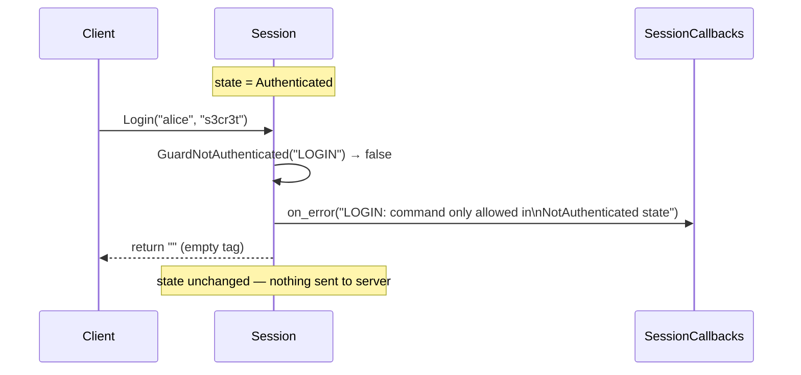
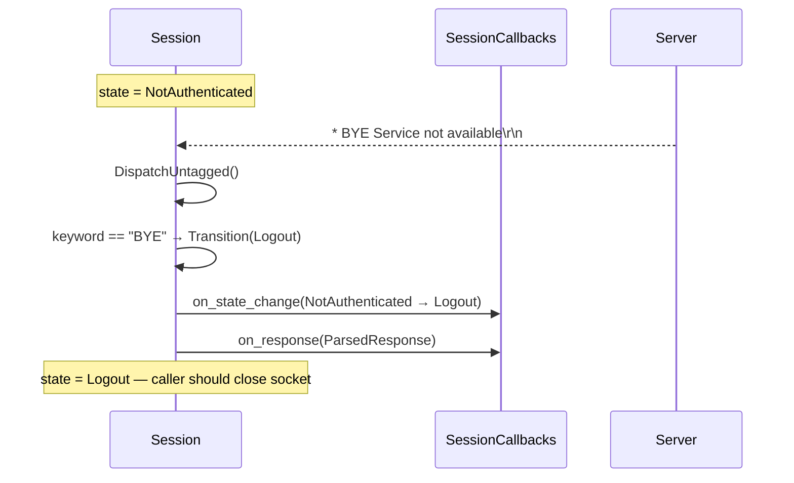

# Authentication Flows

All flows start from `NotAuthenticated` state unless noted.

---

## 1. PREAUTH Greeting (server-side pre-authentication)

The server sends `* PREAUTH` instead of `* OK`. No login command is required.

---

## 2. Successful LOGIN

---

## 3. Failed LOGIN (wrong credentials)

---

## 4. STARTTLS then LOGIN

The client upgrades the connection to TLS before authenticating.
`STARTTLS` is only valid in `NotAuthenticated` state.

---

## 5. AUTHENTICATE (SASL) — e.g. PLAIN

The server sends a `+` continuation with a Base64 challenge; the client
responds with the SASL token.

---

## 6. AUTHENTICATE — Server Sends Multiple Challenges

---

## 7. LOGIN Guard Rejection (already authenticated)

---

## 8. BYE Greeting (server refuses connection)

