# Mailbox Operations

All flows assume `state = Authenticated` unless noted.
`Selected` state inherits all Authenticated-state commands.

---

## 1. SELECT — Open a Mailbox (read-write)

The server sends several untagged responses before the final tagged `OK`.
`Session` collects them into a `SelectData` snapshot and delivers it in
`on_complete`.

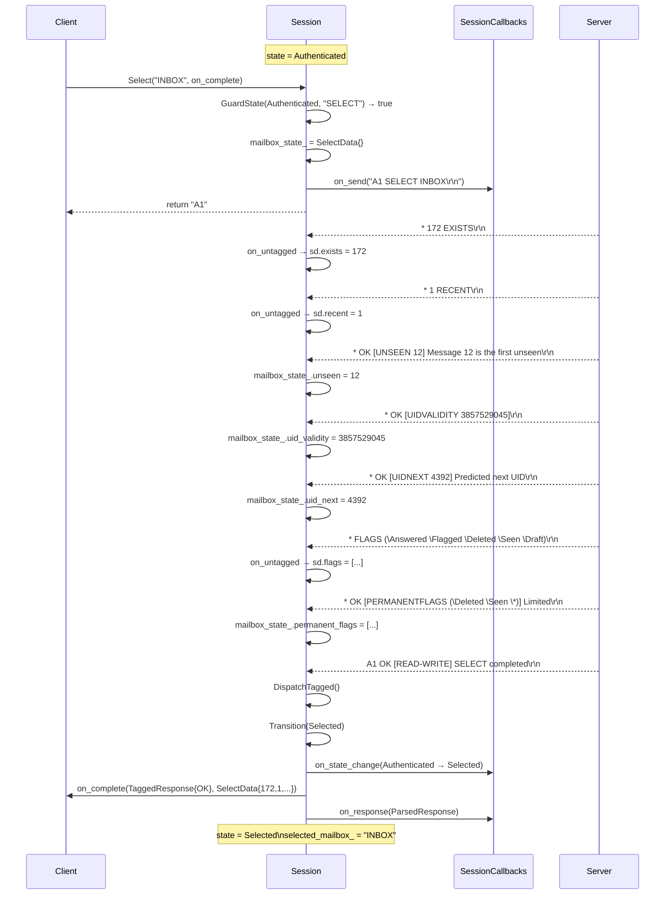

---

## 2. SELECT — Failed (mailbox does not exist)

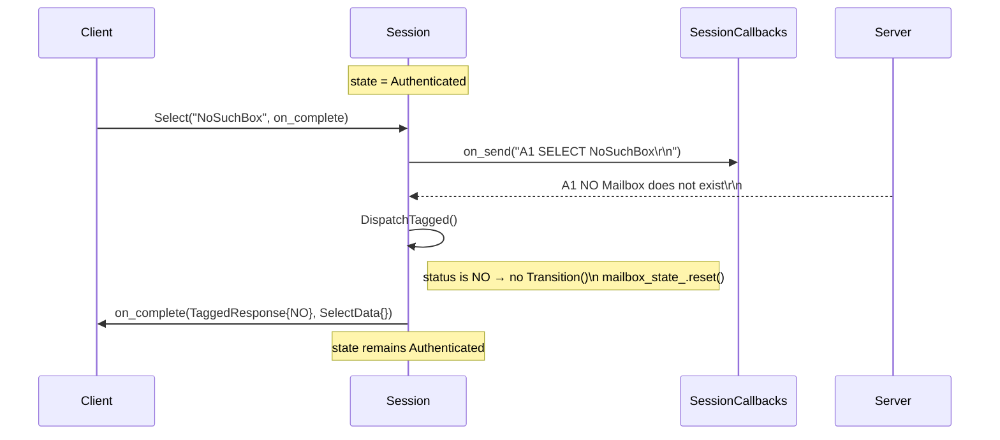

---

## 3. EXAMINE — Open Mailbox (read-only)

Identical flow to `SELECT` except the tagged response carries `[READ-ONLY]`
and state transitions to `Selected` with `mailbox_state_.read_only = true`.

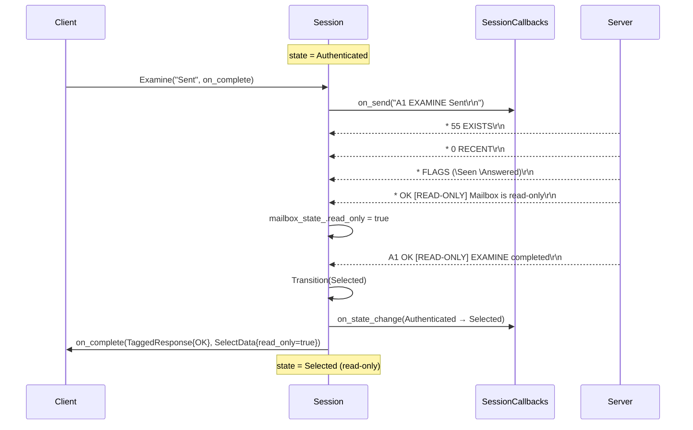

---

## 4. CLOSE — De-select Mailbox (implicitly expunges deleted messages)

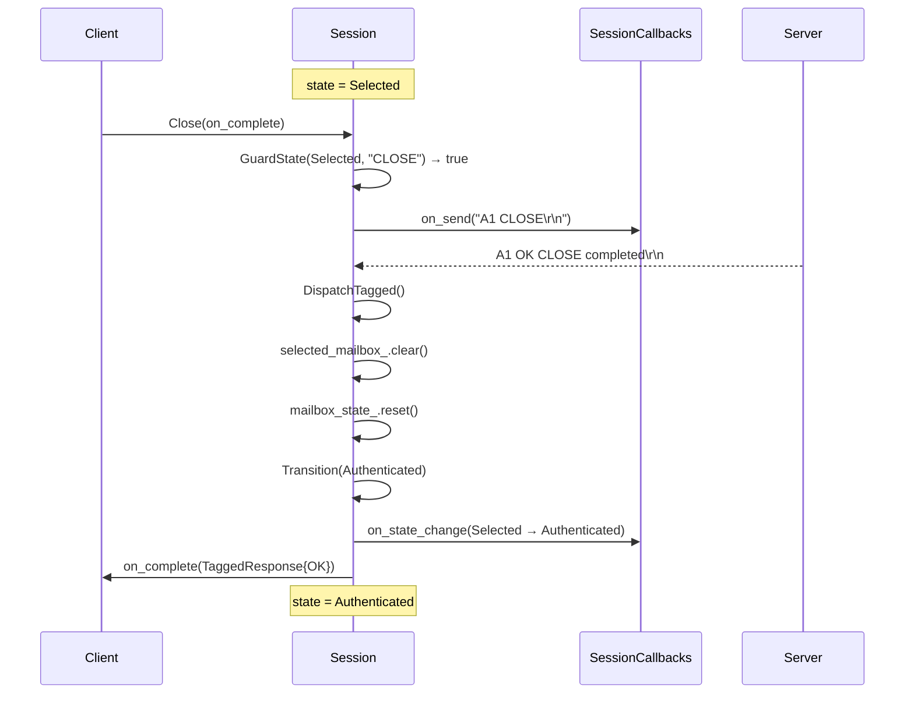

---

## 5. CREATE / DELETE / RENAME

Short one-round-trip commands — shown together for brevity.

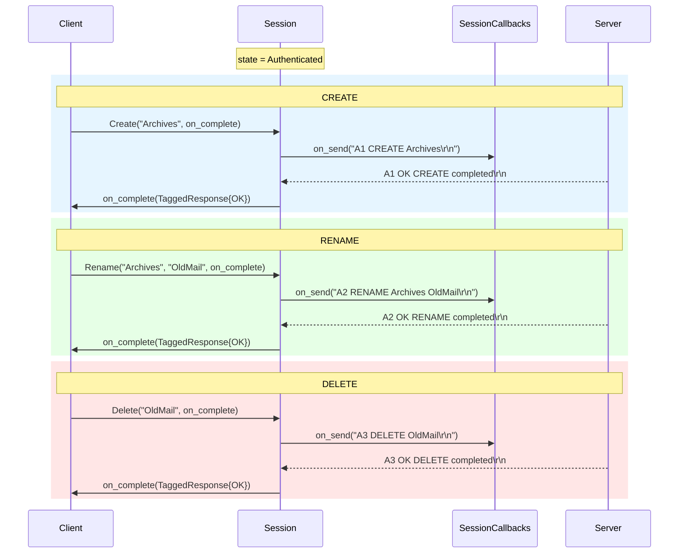

---

## 6. LIST — Enumerate Mailboxes

The server returns zero or more `* LIST` untagged lines before the tagged OK.

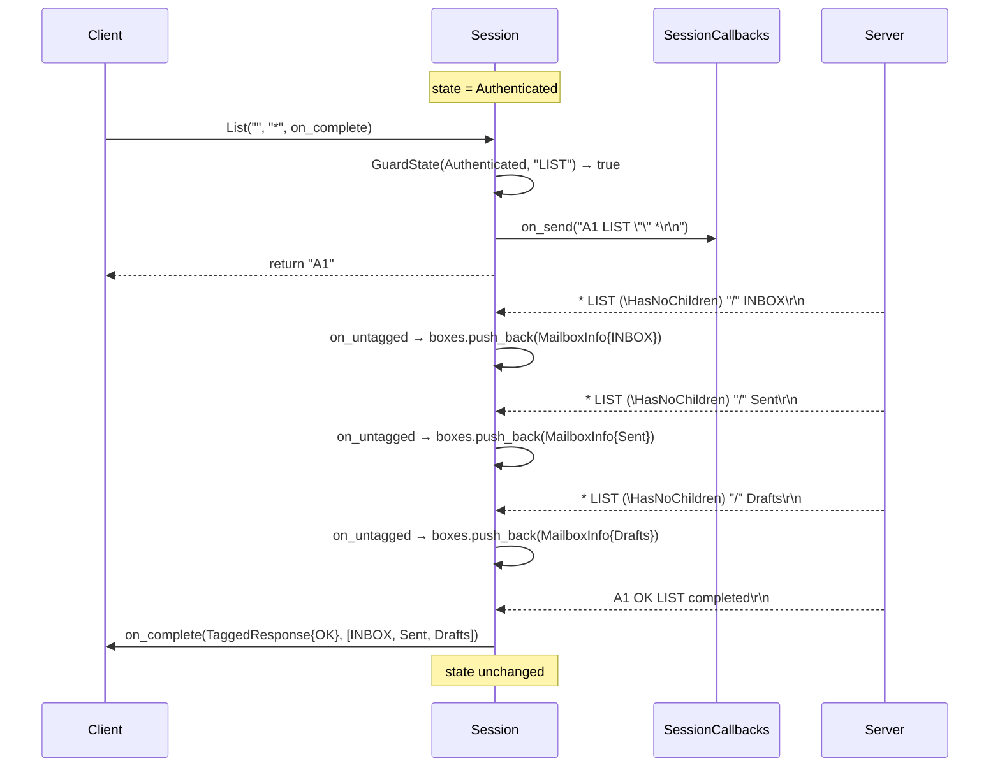

---

## 7. LSUB — List Subscribed Mailboxes

Identical flow to `LIST` but uses `LSUB` command.

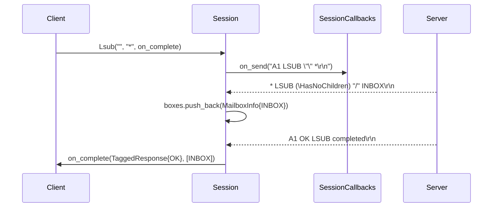

---

## 8. STATUS — Query Mailbox Metadata Without Selecting

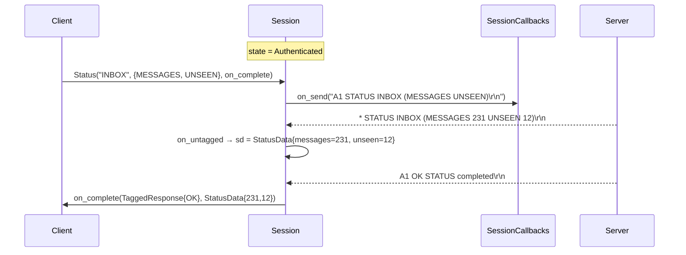

---

## 9. SUBSCRIBE / UNSUBSCRIBE

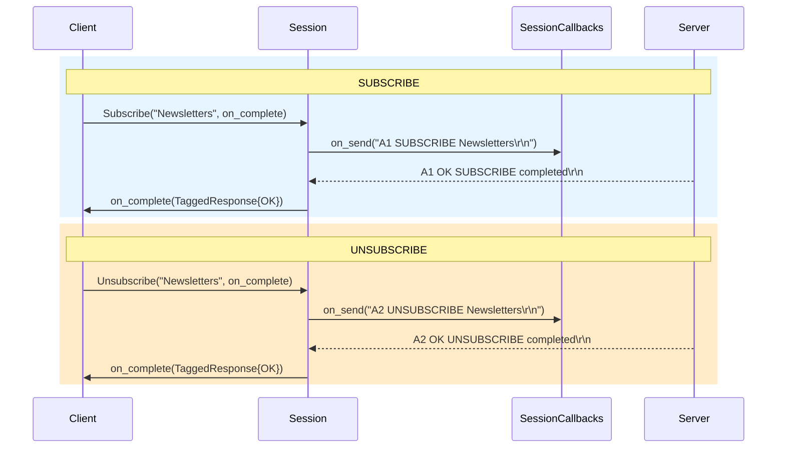

---

## 10. CAPABILITY — Query Server Capabilities

`CAPABILITY` is valid in **any** state and has no guard.

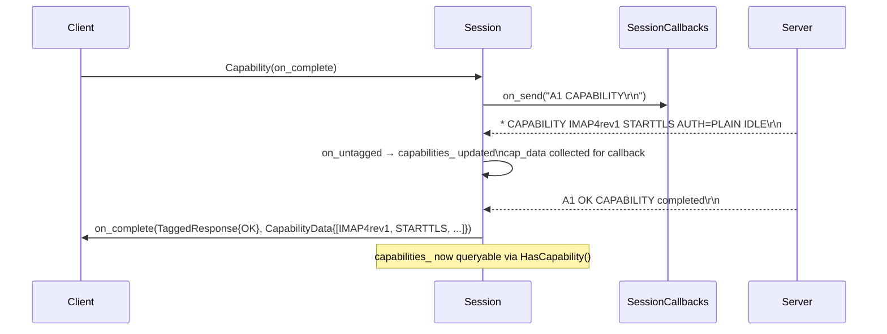

---

## 11. NOOP — Keep-alive / Flush Pending Responses

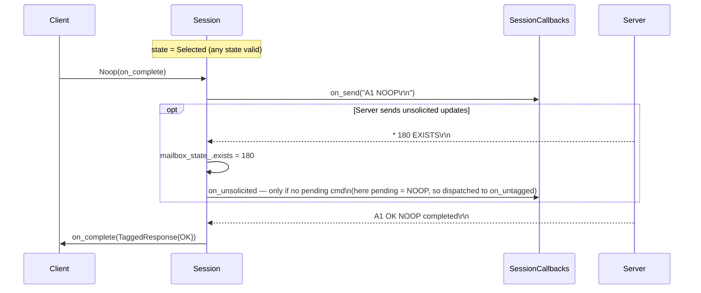
