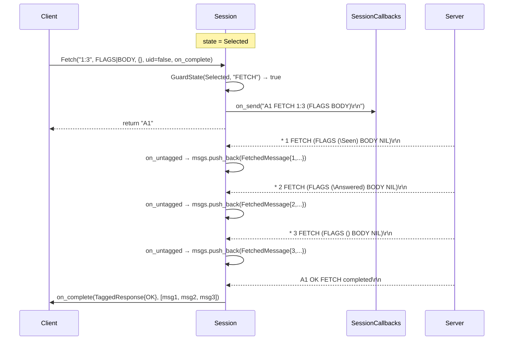
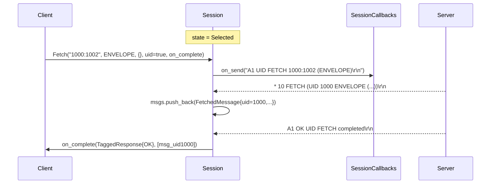
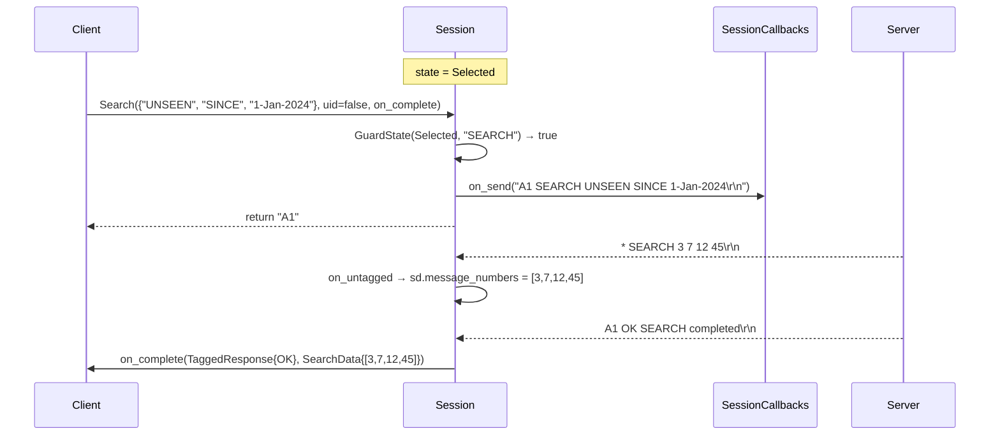
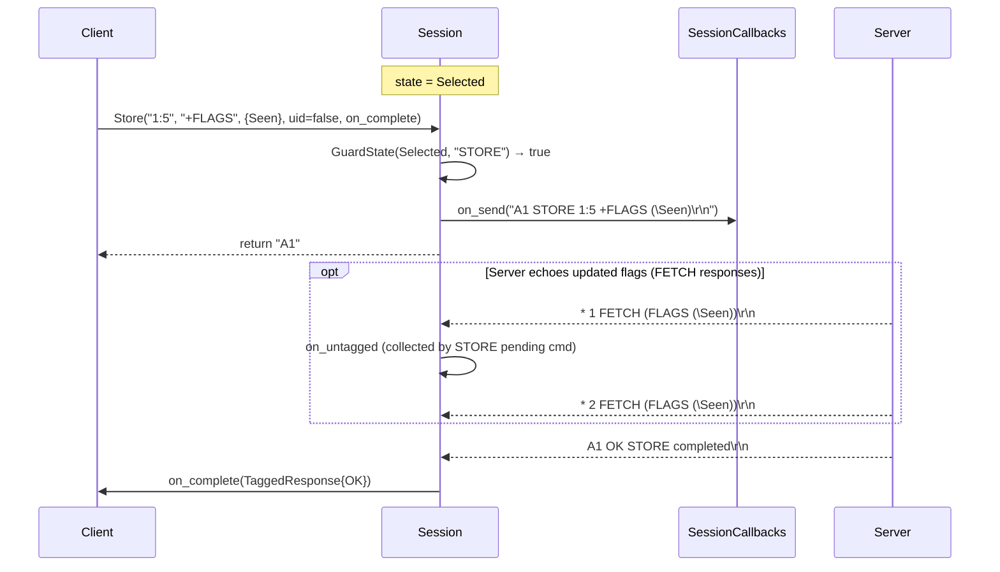
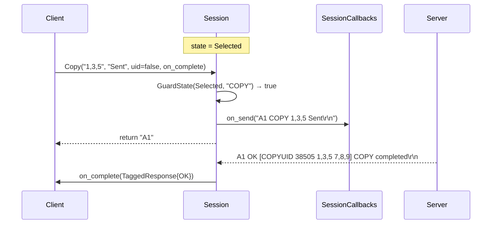
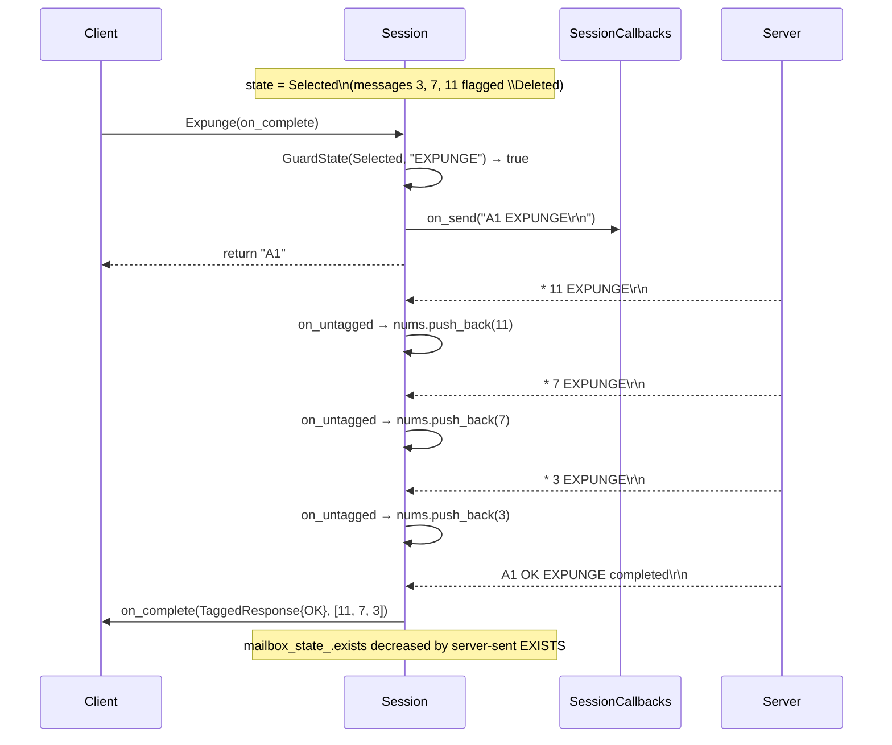
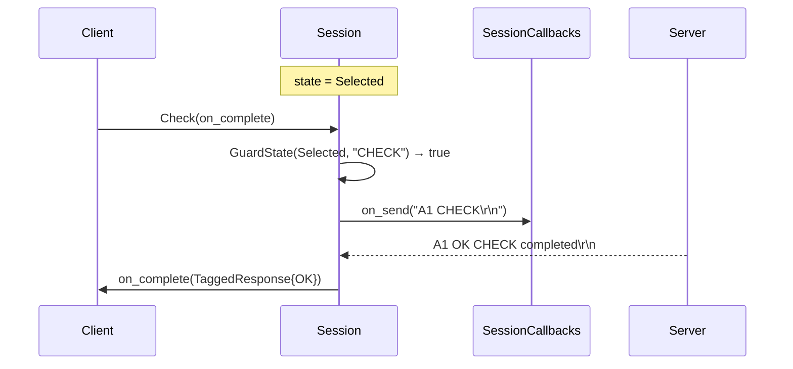
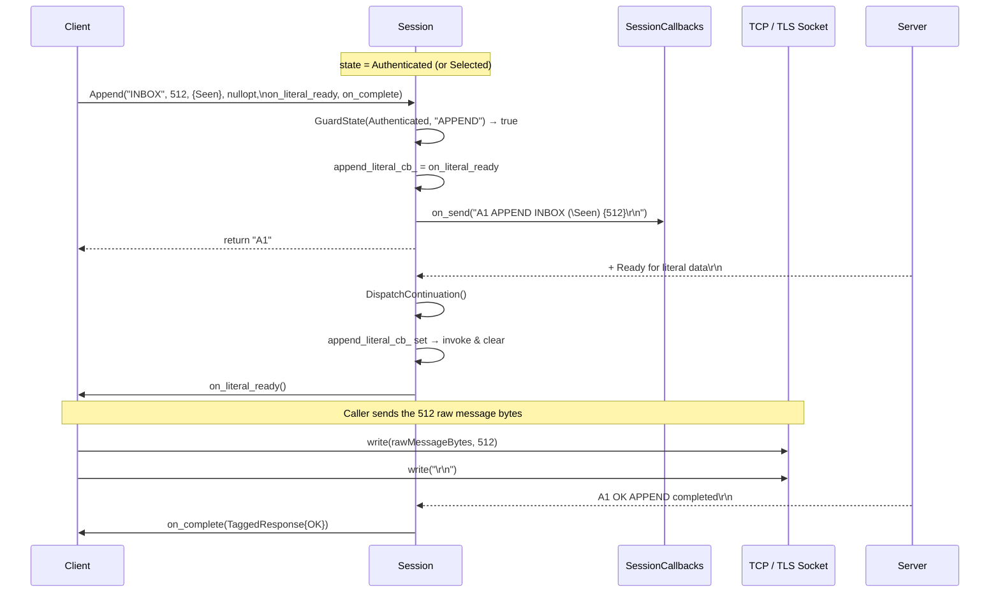
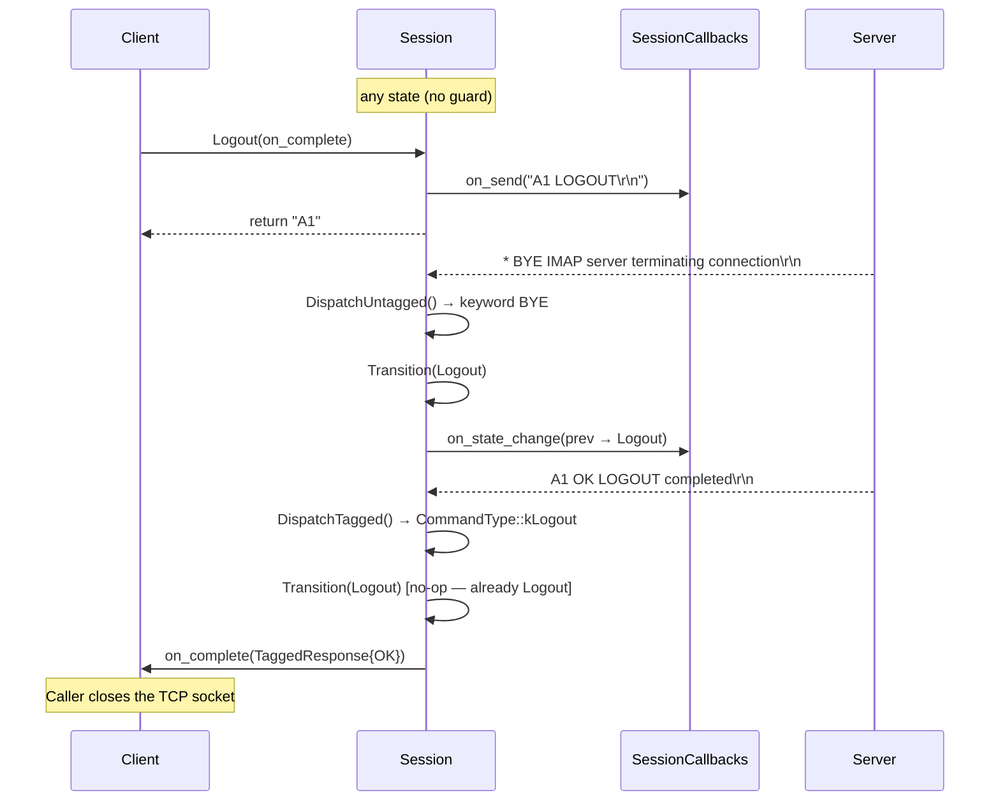

# Message Operations

All flows require `state = Selected` unless noted.

---

## 1. FETCH — Retrieve Messages

The server returns one `* N FETCH` untagged line per requested message.
`Session` accumulates them in a shared `vector<FetchedMessage>` and
delivers the complete list in `on_complete`.

---

## 2. UID FETCH

Same as above — `uid=true` prepends `UID` to the generated command line.

---

## 3. SEARCH — Find Messages

---

## 4. STORE — Update Message Flags

---

## 5. COPY — Copy Messages to Another Mailbox

---

## 6. EXPUNGE — Remove Deleted Messages

The server sends one `* N EXPUNGE` line per deleted message (in reverse
order). `Session` collects their sequence numbers and delivers them in
`on_complete`.

---

## 7. CHECK — Request a Mailbox Checkpoint

---

## 8. APPEND — Upload a Message (literal flow)

`APPEND` uses IMAP literal syntax. The server issues a `+` continuation
before the client may transmit the raw message bytes.

---

## 9. LOGOUT — Graceful Session Teardown

