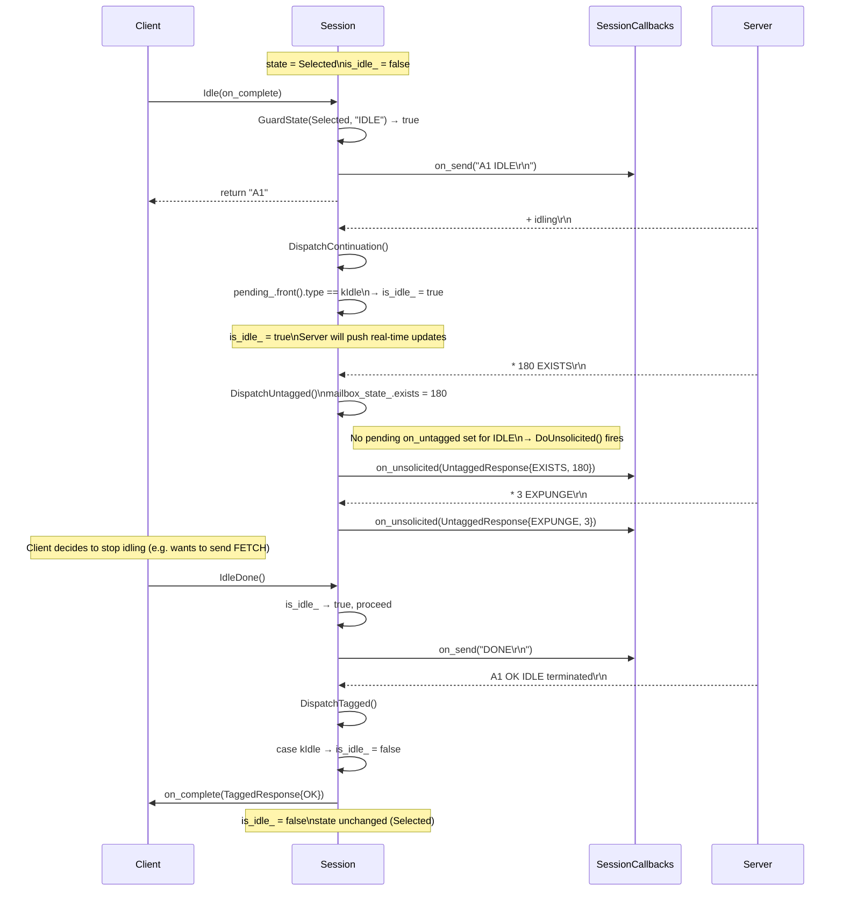
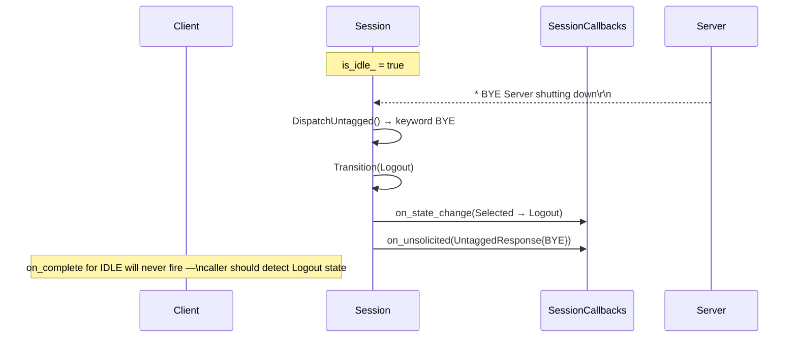
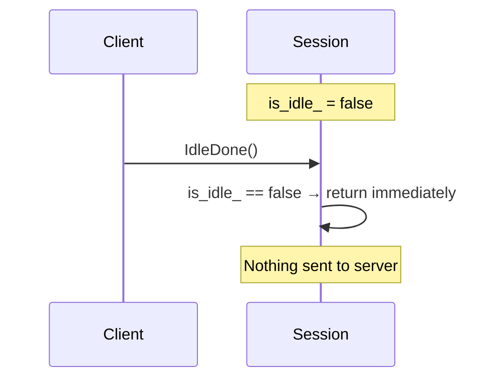
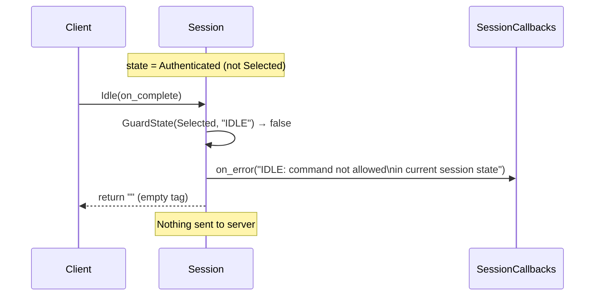

# IDLE Flow (RFC 2177)

`IDLE` is only valid in `Selected` state. It tells the server to push
unsolicited updates (EXISTS, EXPUNGE, FLAGS, etc.) without the client polling
with `NOOP`. The client terminates IDLE by calling `IdleDone()`.

---

## 1. Normal IDLE — Enter, Receive Update, Exit

---

## 2. IDLE — Server Terminates (BYE during idle)

---

## 3. IdleDone() Called When Not in IDLE (no-op)

---

## 4. IDLE Rejected — Wrong State

