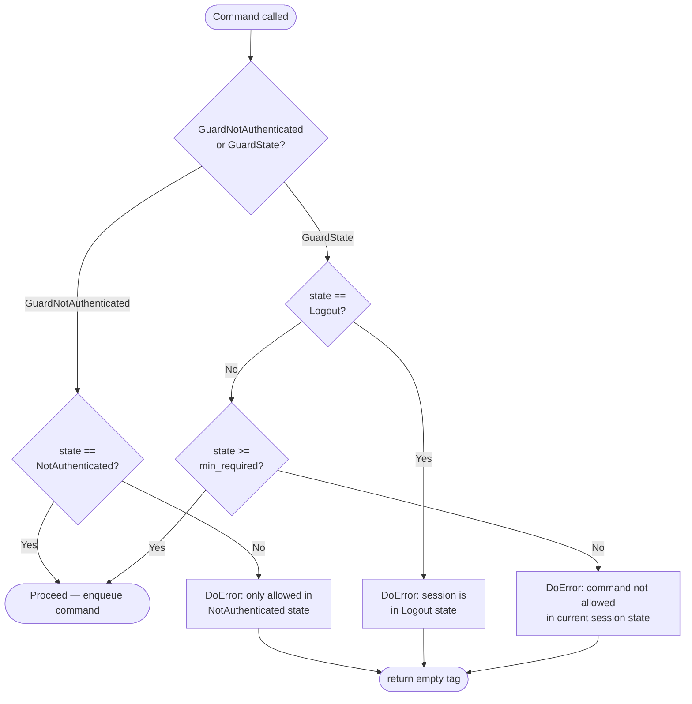
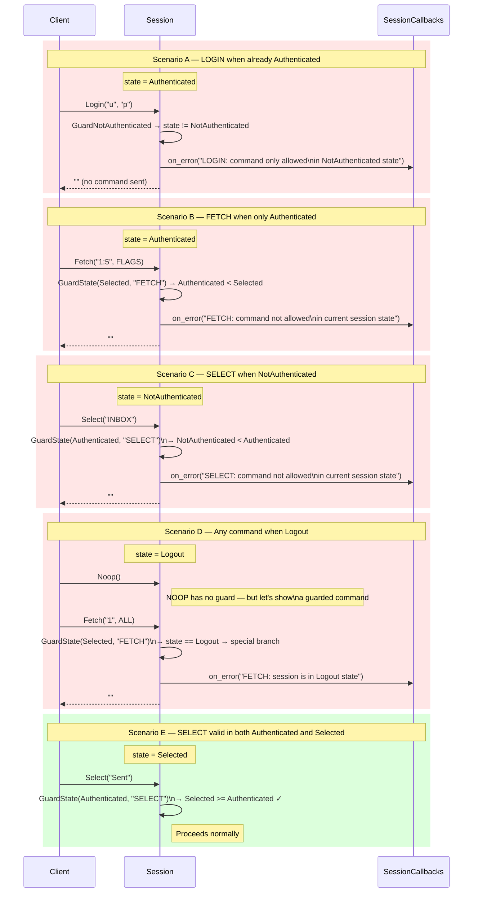
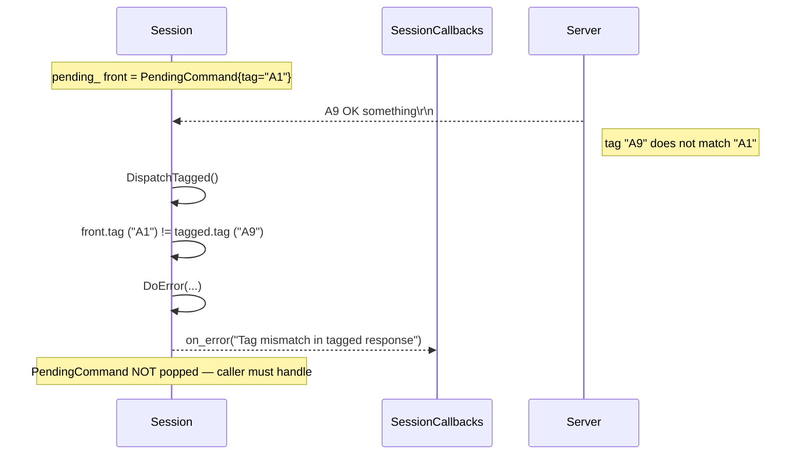
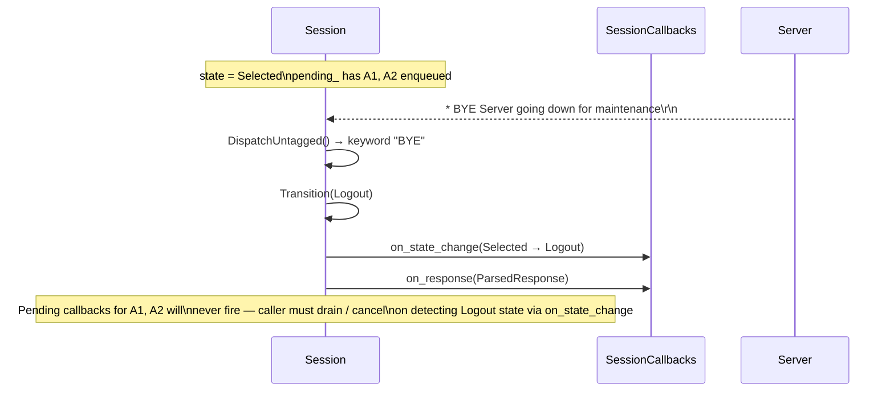
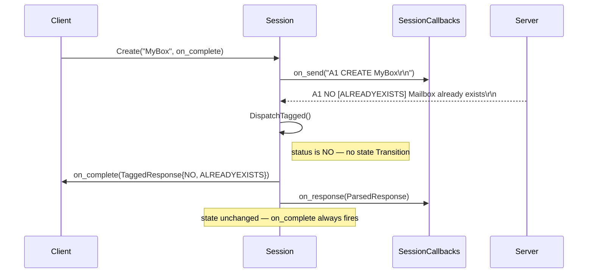
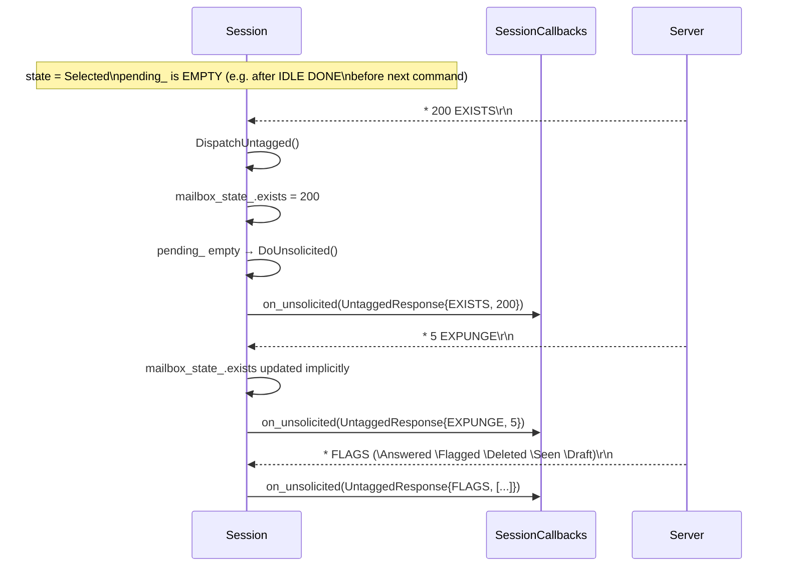
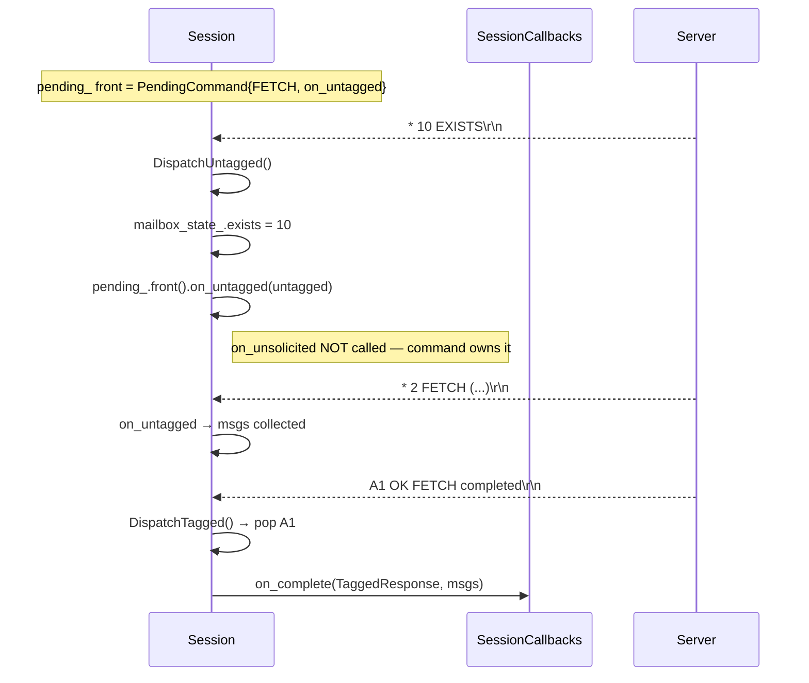
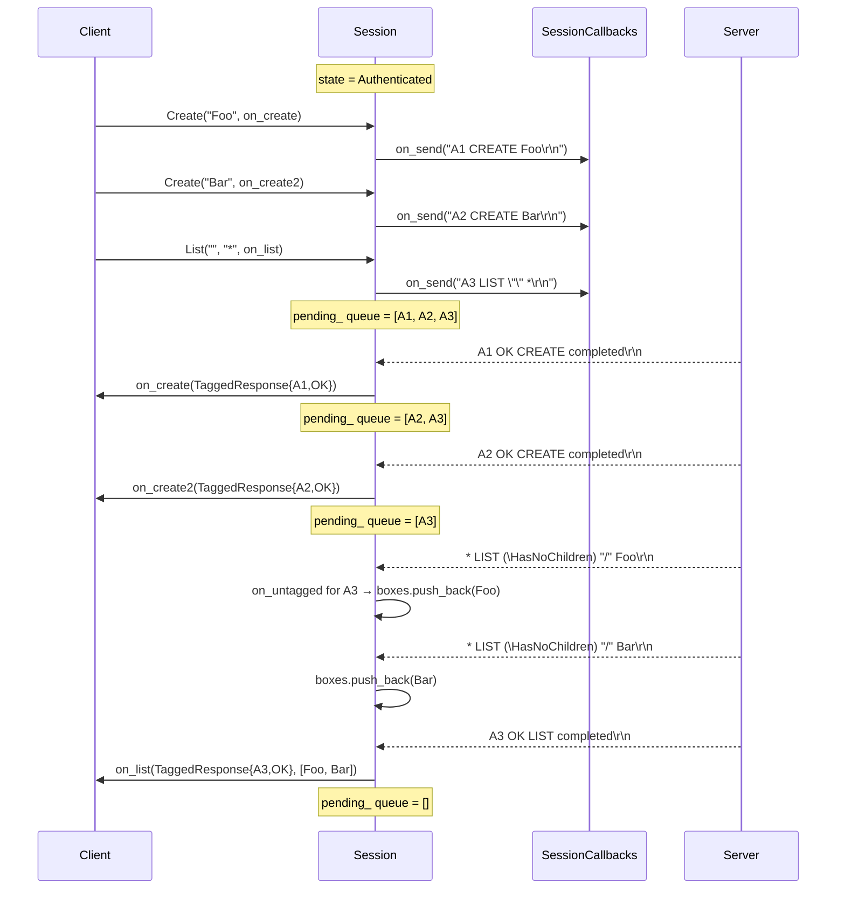

# Error Handling & Guard Flows

---

## 1. State Guard — Command Not Allowed in Current State

`GuardState(min_required, cmd)` fires when the session state is below the
minimum required by a command **or** is already `Logout`.
`GuardNotAuthenticated(cmd)` fires when the session state is **not**
`NotAuthenticated` (LOGIN / AUTHENTICATE / STARTTLS are pre-auth only).

---

## 2. Guard Scenarios — Decision Matrix

---

## 3. Tagged Response with Wrong Tag (Protocol Error)

---

## 4. Unsolicited BYE (Server Terminates Mid-Session)

---

## 5. Server Sends NO or BAD to a Command

---

## 6. Unsolicited Updates While No Command is Pending

---

## 7. Unsolicited Updates While a Command IS Pending

When a command is in-flight, untagged responses that arrive are delivered to
`pending_.front().on_untagged` instead of `on_unsolicited`.

---

## 8. Command Pipeline — Multiple In-Flight Commands

IMAP allows pipelining (sending the next command before the previous tagged
response arrives). `Session` maintains a FIFO queue and dispatches each
tagged response to the head of the queue.

